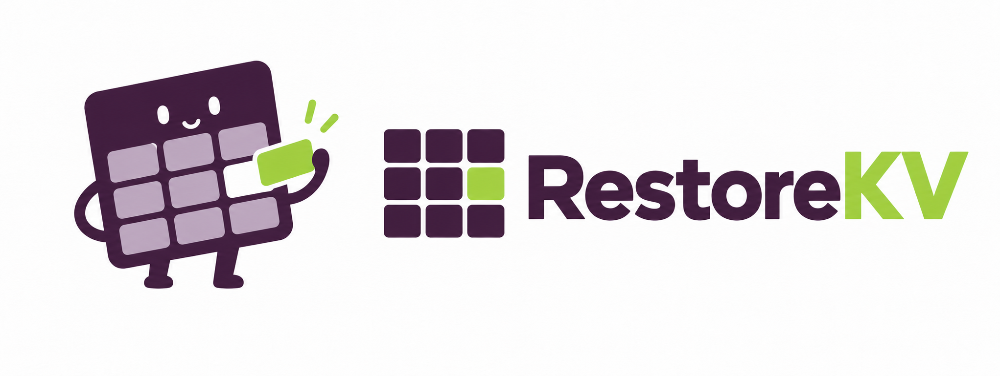

<p align="center">
  
</p>

<h3 align="center">RestoreKV: Recovering Full-Cache Behavior Under Aggressive Query-Agnostic KV Cache Eviction</h3>

<p align="center">
  <a href="https://sites.google.com/view/changwoobaek00/%ED%99%88">Changwoo Baek</a><sup>1</sup> &nbsp;·&nbsp;
  <a href="https://ansl-lab.github.io/professor/">Seungjun Shin</a><sup>2†</sup> &nbsp;·&nbsp;
  <a href="https://www.pnu-cvsp.com/prof">Kyeongbo Kong</a><sup>1†</sup>
  <br>
  <sup>1</sup>Pusan National University &nbsp;·&nbsp; <sup>2</sup>Sookmyung Women's University
</p>

<p align="center">
  <a href="https://arxiv.org/abs/2608.01247"></a>
  <a href="https://paper.pnu-cvsp.com/RestoreKV/"></a>
  <a href="https://github.com/NVIDIA/kvpress/blob/main/kvpress/presses/restorekv_press.py"></a>
  <a href="https://huggingface.co/collections/higokri/restorekv"></a>
  <a href="https://huggingface.co/spaces/nvidia/kvpress-leaderboard"></a>
</p>

---

> **🏆 #1 on the [KVPress Leaderboard](https://huggingface.co/spaces/nvidia/kvpress-leaderboard).**

**RestoreKV** complements selection-based query-agnostic KV cache eviction with **learned restoration** under
the same total KV budget. After context prefill, a few restore tokens attend to the full KV cache in a single
**LoRA-adapted pass**, generating a compact, context-conditioned **restore cache**. The base importance scorer and
eviction rule remain unchanged, and the adapters are disabled for all subsequent queries and decoding. RestoreKV is
trained through parameter-efficient **self-distillation** from the frozen full-cache model, optimizing only **0.4%** of
the parameters and requiring no task-specific tuning.

- Improves **59 of 60** paired, budget-matched settings across five base eviction methods (Qwen3-4B).
- At a **5%** budget, raises KVzip from **38.2 → 73.2** on RULER-4K.
- Applied to KVzip+, reaches **86.4** RULER accuracy at **16×** compression on the KVPress Benchmark, while adding
  **<0.5%** one-time cache-construction overhead in a 32K-context evaluation.

## 🔗 Resources

| | |
|---|---|
| 📄 **Paper** | [arXiv:2608.01247](https://arxiv.org/abs/2608.01247) |
| 🌎 **Project page** | [paper.pnu-cvsp.com/RestoreKV](https://paper.pnu-cvsp.com/RestoreKV/) |
| ⚙️ **Inference code** | [`restorekv_press.py` in NVIDIA/KVPress](https://github.com/NVIDIA/kvpress/blob/main/kvpress/presses/restorekv_press.py) |
| 🤗 **Weights** | [huggingface.co/collections/higokri/restorekv](https://huggingface.co/collections/higokri/restorekv) |
| 🏆 **Leaderboard** | [KVPress Leaderboard](https://huggingface.co/spaces/nvidia/kvpress-leaderboard) — **1st place** |

## 🚀 Usage

RestoreKV runs **standalone in this repository** — no external framework required. After
[installation](#installation), evaluate any supported model with the restore adapters shipped in
`checkpoints/`:

```bash
KVZIP_EVAL_RATIOS="0.4,0.2,0.1,0.05" \
python experiments/eval_learnable_restore.py \
  -m qwen3-4b -d longhealth --level pair --budget-mode budget-matched \
  --restore-checkpoint checkpoints/qwen3-4b_restorekv.pt --tag restorekv
```

This is the reference implementation used for the paper; see
[Reproduce from this repository](#️-reproduce-from-this-repository) for full training/evaluation usage.

RestoreKV is **also integrated into [NVIDIA KVPress](https://github.com/NVIDIA/kvpress)** as
`RestoreKVPress` for drop-in inference in that framework, with adapters on the
[🤗 Hugging Face collection](https://huggingface.co/collections/higokri/restorekv):

```python
from kvpress import RestoreKVPress

# Wrap any base eviction press with a learned, budget-matched restore pass.
press = RestoreKVPress(...)
```

See [`kvpress/presses/restorekv_press.py`](https://github.com/NVIDIA/kvpress/blob/main/kvpress/presses/restorekv_press.py)
for the KVPress inference implementation and arguments.

## 🛠️ Reproduce from this repository

This repository contains the full **training** and **evaluation** code used in the paper.

### Installation

```bash
conda create -n restorekv python=3.10 -y && conda activate restorekv
pip install -r requirements.txt
pip install flash-attn --no-build-isolation      # requires a matching torch/CUDA
cd csrc && python build.py install && cd ..       # KV-cache gather kernel (needs nvcc)
```

Tested with PyTorch 2.8 / CUDA 12.8, `transformers==4.51.3`, `flash-attn` 2.8. Base
models download from the Hugging Face Hub on first use; gated models (e.g.
`meta-llama/Llama-3.1-8B-Instruct`) require `huggingface-cli login`.

### Assets (weights & training data)

There are **two different checkpoint formats**, and they are **not interchangeable**:

| Asset | Format / used by | Contents | Link |
|---|---|---|---|
| Restore checkpoints | **This repo** (`experiments/eval_learnable_restore.py --restore-checkpoint`) | `checkpoints/*.pt`, 6 adapters (Qwen3-4B / Qwen3-8B / Llama-3.1-8B × RestoreKV / RestoreKV+) | **included** in `checkpoints/` |
| Training data | this repo (`--teacher-responses-path`) | `data/sft_data/*_train_mix.jsonl`, teacher-distilled triples (one file per model) | [Google Drive](https://drive.google.com/file/d/1UUfIPS16YAqegaFAInRL6qeTuGxBWfDm/view?usp=sharing) |
| KVPress weights | **NVIDIA/KVPress** (`kvpress.RestoreKVPress`) | adapters in KVPress inference format | [🤗 HF collection](https://huggingface.co/collections/higokri/restorekv) |

> The Hugging Face weights are packaged for **KVPress inference** and will **not** load with this
> repository's training/eval code, and vice-versa. The `.pt` checkpoints shipped in `checkpoints/`
> are the ones to use to reproduce the paper's numbers with the code here.

The restore checkpoints are already in `checkpoints/`; only the training data is external:

```bash
# download restorekv_train_data.zip from the Google Drive link above, then:
unzip restorekv_train_data.zip                  # -> data/sft_data/*_train_mix.jsonl
# (or: pip install gdown && gdown 1UUfIPS16YAqegaFAInRL6qeTuGxBWfDm)
```

Evaluation datasets (QuALITY, QASPER, LongHealth) are bundled under `data/`; SCBench and
RULER download from the Hub on first use.

### Training

Trainable = 8 restore-token embeddings + LoRA (rank 8, α 16) on q/k/v/o and MLP projections,
AdamW, lr 2e-4, cosine schedule, 5000 steps, symmetric-KL self-distillation against the
full-KV teacher, KV keep-ratio sampled from U(0.025, 0.25).

```bash
# RestoreKV (KVzip scoring); add KVZIP_PLUS=1 for RestoreKV+
python experiments/train_learnable_restore.py \
  -m qwen3-4b --data-source teacher-responses \
  --teacher-responses-path data/sft_data/qwen3-4b_train_mix.jsonl \
  --output-dir runs/restorekv_qwen3-4b \
  --level pair --num-restore-tokens 8 --lora-rank 8 --lora-alpha 16 \
  --restore-lr 2e-4 --lora-lr 2e-4 --max-steps 5000 --val-every 500 --save-every 500 \
  --kl-mode symmetric --distill-alpha 1.0 --ratio-min 0.025 --ratio-max 0.25 \
  --budget-mode budget-matched --seed 0
```

### Evaluation

```bash
# RestoreKV: KVzip scoring + learned restoration (budget-matched)
KVZIP_EVAL_RATIOS="0.4,0.2,0.1,0.05" \
python experiments/eval_learnable_restore.py \
  -m qwen3-4b -d longhealth --level pair --budget-mode budget-matched \
  --restore-checkpoint checkpoints/qwen3-4b_restorekv.pt --tag restorekv

# baselines (no restore): eval.py, optionally KVZIP_PLUS=1 for KVzip+
KVZIP_EVAL_RATIOS="0.4,0.2,0.1,0.05" python eval.py -m qwen3-4b -d longhealth --level pair --tag kvzip
```

Swap `-d longhealth` for `quality` / `qasper`, or an `scbench_*` task / `ruler_{4096,8192,16384}`
config. SCBench and RULER write per-sample generations to `results/` and are graded by the
dedicated scorers (`results/parse_fix.py`, `scripts/score_ruler4k_kvpress.py`).

## 🗺️ Release Plan

- [x] Inference code (integrated into [NVIDIA/KVPress](https://github.com/NVIDIA/kvpress))
- [x] Pretrained restore adapters ([Hugging Face](https://huggingface.co/collections/higokri/restorekv))
- [x] Full training & evaluation code (this repository)

## 📄 License

The code in this repository is released under the [MIT License](LICENSE), as it builds on
[KVzip](https://github.com/snu-mllab/KVzip) (MIT, © snu-mllab); the KV-cache gather kernel adapts
[AdaKV](https://github.com/FFY0/AdaKV).

The **training-data mixtures are for research / non-commercial use only.** Because the mixture
contains LongAlpaca-derived self-study data, it inherits the most restrictive component license,
**CC BY-NC 4.0**. Components: [LongAlpaca-12k](https://huggingface.co/datasets/Yukang/LongAlpaca-12k)
(CC BY-NC 4.0), [PG-19](https://huggingface.co/datasets/deepmind/pg19) (Apache-2.0, public domain),
and the `flan_v2` subset of [Tulu-3](https://huggingface.co/datasets/allenai/tulu-3-sft-mixture)
(ODC-BY-1.0; FLAN v2 Apache-2.0). Bundled evaluation datasets:
[QuALITY](https://github.com/nyu-mll/quality) (CC BY 4.0),
[QASPER](https://huggingface.co/datasets/allenai/qasper) (CC BY 4.0), and
[LongHealth](https://github.com/kbressem/LongHealth) (Apache-2.0). These data terms are separate
from and additional to the code license.

## 📚 Citation

```bibtex
@article{baek2026restorekv,
  title   = {RestoreKV: Recovering Full-Cache Behavior Under Aggressive Query-Agnostic KV Cache Eviction},
  author  = {Baek, Changwoo and Shin, Seungjun and Kong, Kyeongbo},
  journal = {arXiv preprint arXiv:2608.01247},
  year    = {2026}
}
```

## 🙏 Acknowledgements

RestoreKV builds on [KVzip](https://github.com/snu-mllab/KVzip) for query-agnostic context-reconstruction eviction —
we thank the authors for their great work — and its inference is implemented on top of
[NVIDIA KVPress](https://github.com/NVIDIA/kvpress). RestoreKV is part of the
[BTS — Busan Token-pruning Series](https://higokri.github.io/BTS/) from the
[PNU-CVSP](https://www.pnu-cvsp.com/) lab.
